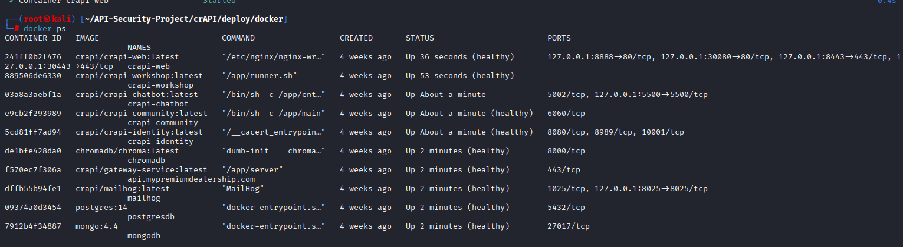

# crAPI API Security Testing Project

## Project Overview
This project demonstrates API security testing performed on OWASP crAPI (Completely Ridiculous API), a deliberately vulnerable API application designed for learning and practicing API security.

The testing environment was deployed locally on Kali Linux using Docker.

## Lab Environment
- Kali Linux
- OWASP crAPI
- Docker & Docker Compose
- Burp Suite
- Postman
- Web Browser

## Project Objectives
The main objectives of this project are:

- Deploy OWASP crAPI locally using Docker
- Understand API requests and responses
- Intercept API traffic using Burp Suite
- Test API endpoints using Postman
- Identify potential API security vulnerabilities
- Document testing steps and results

## Lab Setup

### Step 1 - Clone OWASP crAPI

The crAPI repository was cloned from the official OWASP project.

### Step 2 - Deploy crAPI Using Docker

The application was deployed using Docker Compose.

### Step 3 - Verify Running Containers

The following command was used to verify that the crAPI containers were running successfully:

`docker ps`

All required containers were running and healthy.

### Evidence

## Security Testing

API security testing was performed in an authorized local lab environment created specifically for security training.

Further testing steps, findings, and evidence are documented in this repository.
